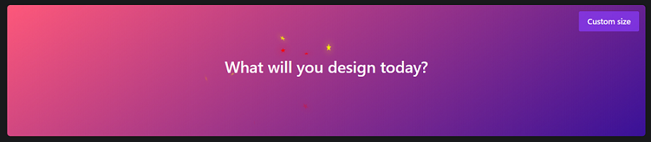

# canva-magical-mouse-effect



# Installing

```bash
npm install canva-magical-mouse-effect --save
```

# Example 1

```bash
import CanvaMagic from 'canva-magical-mouse-effect'

const App = ()=>{
    return (
        <div style={{width:"800px",height:"300px"}}>
            <CanvaMagic/>
        </div>
    )
}
export default App
```

# Example 2

```bash
import CanvaMagic from 'canva-magical-mouse-effect'

const App = ()=>{

    const options = {

        removeStarTime: 3500,
        iconText: "★",
        cursorStyle: true,
        iconFontSizes: ["30px"],
        background: "linear-gradient(145deg, #FF597B, rgb(58, 18, 153))",
        starColors: ["orange", "yellow", "#FF597B"]

  }

    return (
        <div style={{width:"800px",height:"300px"}}>
            <CanvaMagic options={options}>
                <div>
                    <span>canva-magical-mouse-effect</span>
                </div>
            </CanvaMagic>
        </div>
    )
}
export default App
```